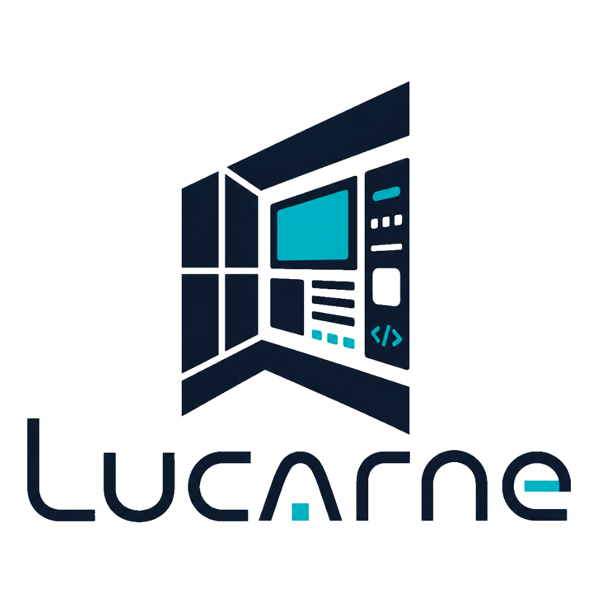
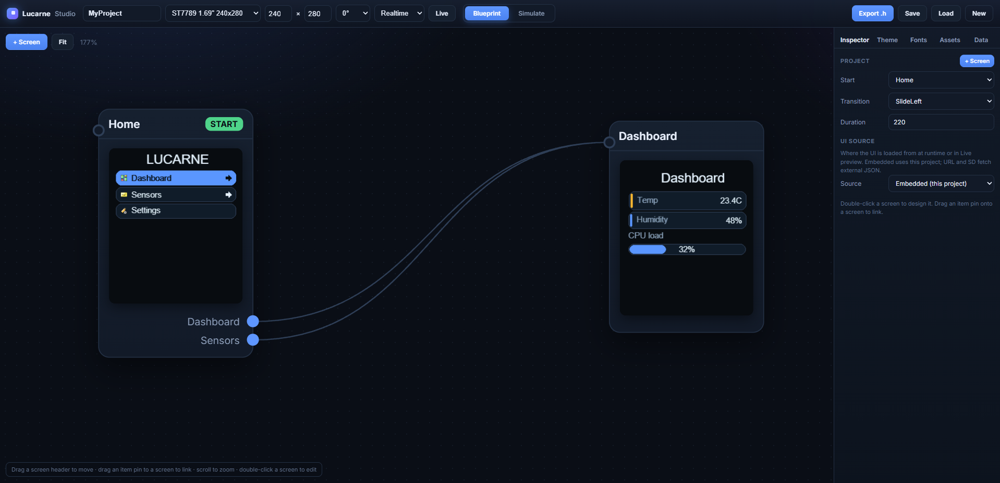
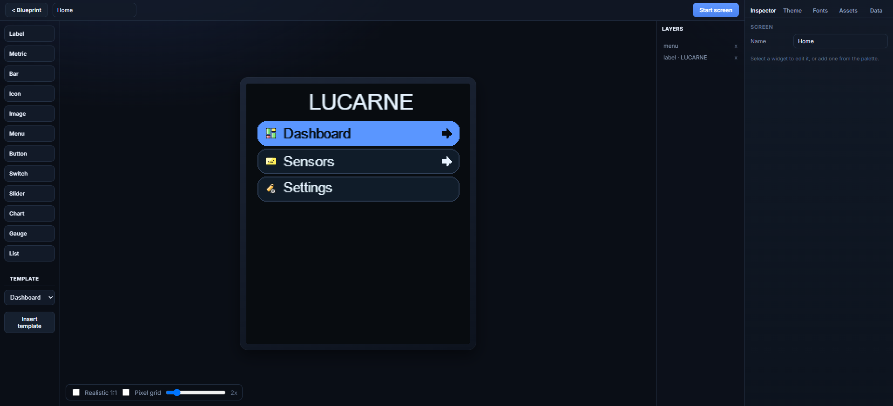
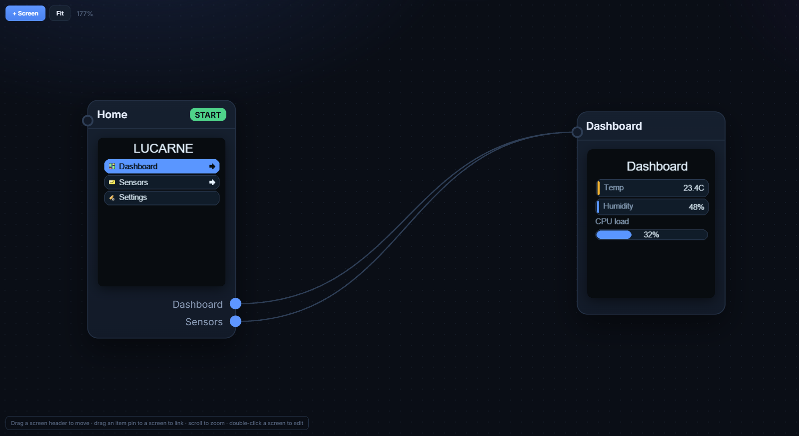

<div align="center">



# Lucarne

**UI toolkit for small SPI displays on Arduino and ESP32**

Standalone drivers, a lightweight UI runtime, and a visual web Studio with C++ export.

[](https://github.com/Pupariaa/Lucarne/releases)
[](https://github.com/Pupariaa/Lucarne/releases)
[](LICENSE)
[](https://www.arduino.cc/)
[](https://platformio.org/)
[](https://www.espressif.com/)
[](docs/HARDWARE.md)
[](docs/HARDWARE.md)

[Documentation](https://techalchemy.fr/Lucarne/doc/) · [Studio](https://techalchemy.fr/Lucarne/editor/) · [Issues](https://github.com/Pupariaa/Lucarne/issues) · [Releases](https://github.com/Pupariaa/Lucarne/releases)

</div>

### Preview

<p align="center">
  
  
  
</p>

<p align="center">
  <sub><strong>Studio</strong> — design screens, wire menu flows, export <code>Projet.h</code></sub><br />
  <sub><strong>Live Preview</strong> (ESP32-S3 + USB) —  see <a href="docs/LIVE_PREVIEW.md">docs/LIVE_PREVIEW.md</a></sub>
</p>

> **Hardware photos / demo GIF** — real panel shots and an *editor → export → screen* clip are planned. If you have a clean setup photo, [open a PR](CONTRIBUTING.md).

### Project status

| | |
| --- | --- |
| **Stage** | **Experimental / alpha** (`v0.1.0`) — API, export format, and Studio behaviour may change between minor releases. |
| **Firmware** | Tested on real boards (see [compatibility matrix](#compatibility-matrix) below). Report your combo in [Issues](https://github.com/Pupariaa/Lucarne/issues). |
| **Studio** | Usable online or locally; Live Preview targets **ESP32-S3** with USB CDC. |
| **Stability** | Suitable for prototypes and personal projects; pin a [release tag](https://github.com/Pupariaa/Lucarne/releases) for anything production-critical. |

---

## Table of contents

- [Overview](#overview)
- [Features](#features)
- [Compatibility matrix](#compatibility-matrix)
- [Installation](#installation)
- [Quick start](#quick-start)
- [UI in code](#ui-in-code)
- [Lucarne Studio](#lucarne-studio)
- [Exported projects](#exported-projects)
- [Widgets](#widgets)
- [Examples](#examples)
- [Memory modes](#memory-modes)
- [Documentation](#documentation)
- [Repository layout](#repository-layout)
- [Contributing](#contributing)
- [License](#license)

---

## Overview

Lucarne targets **small color SPI panels** (ST7789, ST7735S) on **Arduino** and **ESP32**. It combines three layers:

| Layer | Role |
| --- | --- |
| **Graphics** | SPI drivers, drawing primitives, optional framebuffer |
| **UI runtime** | Screens, widgets, menus, transitions, data binding |
| **Lucarne Studio** | Browser editor: design, simulate, export `Projet.h` |

No Adafruit GFX dependency. No LVGL-style heavyweight renderer on the device: design in Studio, ship static C++ headers.

---

## Features

- **ST7789 & ST7735S** drivers with panel offsets and rotation
- **Framebuffer modes** — full (transitions + partial flush) or direct draw
- **PSRAM-aware** allocation with automatic fallback
- **Widgets** — labels, metrics, bars, icons, menus, buttons, switches, sliders, charts, gauges, lists, images
- **Animated transitions** — slide, fade, push, cover, and more
- **Data binding** — named keys (`ui.setFloat("temp", …)`) drive widget updates
- **Physical input** — GPIO buttons, rotary encoder, touch feed
- **Lucarne Studio** — visual designer, blueprint, simulation, font import, C++ export
- **Live Preview** — stream the framebuffer to an ESP32-S3 over USB (Chrome/Edge)
- **Built-in fonts** — anti-aliased Fira Sans (`LucarneFontBody`, `LucarneFontTitle`)

---

## Compatibility matrix

Legend: ✓ supported · ~ constrained · ✗ not supported

### MCUs

All boards below have been exercised with Lucarne on SPI displays. Capabilities depend on **RAM**, **PSRAM**, and panel size.

| MCU | UI + SPI | `BufferMode::Full` | Animated transitions | USB Live Preview | PSRAM |
| --- | :---: | :---: | :---: | :---: | :---: |
| **ESP32** (WROOM-32D) | ✓ | ✓ | ✓ | ~ | ✓ |
| **ESP32-S3** | ✓ | ✓ | ✓ | ✓ | ✓ |
| **ESP32-C3** | ✓ | ~ | ~ | ✗ | ~ |
| **ESP32-C5** | ✓ | ✓ | ✓ | ~ | ✓ |
| **ESP32-C6** | ✓ | ~ | ~ | ✗ | ~ |
| **ESP32-P4** | ✓ | ✓ | ✓ | ~ | ✓ |
| **ESP32-H4** | ✓ | ✓ | ✓ | ~ | ✓ |
| **ESP8266** | ✓ | ~ | ✗ | ✗ | ✗ |
| **ATmega328P** | ✓ | ✗ | ✗ | ✗ | ✗ |
| **ATmega32U4** | ✓ | ~ | ✗ | ✗ | ✗ |
| **ATmega2560** | ✓ | ~ | ✗ | ✗ | ✗ |

**Notes**

- **`BufferMode::Full`** needs ~2 bytes × width × height (+ transition snapshots). Lucarne falls back to **`BufferMode::None`** automatically if allocation fails.
- **Animated transitions** require `BufferMode::Full` and enough free RAM for temporary buffers.
- **USB Live Preview** is validated on **ESP32-S3** (USB CDC On Boot). Other ESP32 variants may work with USB CDC but are not the primary target.
- **PSRAM** is not mandatory but strongly recommended on ESP32/S3 for 240×240 panels and larger, fonts, and transitions.
- **AVR** targets: use small panels (e.g. ST7735S 128×160), `BufferMode::None`, and keep UI complexity low.

### Displays

| Panel | Driver | ESP32 family | ESP8266 | AVR |
| --- | --- | :---: | :---: | :---: |
| ST7789 135×240 | ST7789 | ✓ | ~ | ~ |
| ST7789 240×240 | ST7789 | ✓ | ~ | ✗ |
| ST7789 172×320 | ST7789 | ✓ | ✗ | ✗ |
| ST7789 240×280 | ST7789 | ✓ | ✗ | ✗ |
| ST7789 240×320 | ST7789 | ✓ | ✗ | ✗ |
| ST7735S 80×160 | ST7735S | ✓ | ✓ | ✓ |
| ST7735S 128×128 | ST7735S | ✓ | ~ | ~ |
| ST7735S 128×160 | ST7735S | ✓ | ✓ | ✓ |

Pin wiring, SPI modes, offsets: [`docs/HARDWARE.md`](docs/HARDWARE.md).

---

## Installation

### Arduino IDE

1. Download or clone this repository.
2. Copy the folder to `Documents/Arduino/libraries/Lucarne`.
3. Restart the IDE.
4. Open **File → Examples → Lucarne**.

### PlatformIO

Add to `platformio.ini`:

```ini
lib_deps =
    file://../Lucarne
```

Or place the library under `lib/Lucarne/` in your project.

### Include

```cpp
#include <Lucarne.h>
using namespace lucarne;
```

---

## Quick start

Minimal sketch — draw text on an ST7789 panel:

```cpp
#include <Lucarne.h>
using namespace lucarne;

ST7789 display;

void setup() {
    DisplayPins pins;
    pins.cs = 5;
    pins.dc = 16;
    pins.rst = 17;
    pins.mosi = 21;
    pins.sclk = 18;

    DisplayOptions options;
    options.panelWidth = 240;
    options.panelHeight = 280;
    options.spiMode = 3;
    options.invert = true;

    BufferOptions buffer;
    buffer.mode = BufferMode::Full;

    display.begin(pins, options, buffer);
    display.fillScreen(color565(0, 0, 0));
    display.setCursor(20, 20);
    display.setTextColor(color565(255, 255, 255));
    display.print("Hello Lucarne");
    display.display();
}

void loop() {}
```

> **Black screen?** Try `options.spiMode = 3` and `options.invert = true`. Run the `LucarneDiag` example to validate wiring.

---

## UI in code

```cpp
ST7789 display;
UI ui(display);
Screen dashboard("Dashboard");

Label title(0, 14, "Dashboard", TextAlign::Center);
Metric temp(14, 56, 212, 34, "Temp", "temp", "C");
Bar loadBar(14, 166, 212, 20, "load", 0.0f, 1.0f);

void setup() {
    display.begin(/* pins, options, buffer */);

    Theme theme;
    theme.font = &LucarneFontBody;
    theme.fontTitle = &LucarneFontTitle;
    ui.setTheme(theme);

    dashboard.add(&title);
    dashboard.add(&temp);
    dashboard.add(&loadBar);

    ui.setFloat("temp", 23.4f);
    ui.setFloat("load", 0.32f);
    ui.show(&dashboard);
    ui.begin();
}

void loop() {
    ui.setFloat("temp", readTemperature());
    ui.update();
}
```

**Menus, transitions, callbacks, buttons** — see [`examples/LucarneMenu`](examples/LucarneMenu/LucarneMenu.ino) and [`docs/RUNTIME.md`](docs/RUNTIME.md).

**Data binding keys:** `ui.setFloat`, `ui.setInt`, `ui.setBool`, `ui.setString`. Widgets bound to a key redraw only when the value changes.

---

## Lucarne Studio

Design screens in the browser, simulate navigation, export firmware-ready headers.

| Mode | Purpose |
| --- | --- |
| **Blueprint** | Connect screens through menu links |
| **Designer** | Place widgets, edit theme and layout |
| **Fonts** | Google fonts or TTF → exported as C++ |
| **Simulate** | Keyboard or on-screen D-pad |
| **Export** | Download `Projet.h` (+ `Projet_fonts.h` if needed) |

- **Online:** [lucarne.techalchemy.fr/editor](https://techalchemy.fr/Lucarne/editor/)
- **Local:** open `editor/index.html` in a browser (no build step)
- **Live Preview:** flash [`examples/LucarnePreview`](examples/LucarnePreview/LucarnePreview.ino), click **Live** in the editor ([guide](docs/LIVE_PREVIEW.md))

Full editor reference: [`docs/EDITOR.md`](docs/EDITOR.md).

---

## Exported projects

Drop `Projet.h` (and optional `Projet_fonts.h`) next to your sketch:

```cpp
#include <Lucarne.h>
#include "Projet.h"

using namespace lucarne;

ST7789 display;
UI ui(display);

void setup() {
    display.begin(/* your pins and panel */);
    projet::build(ui);
    projet::attachInput(ui);
    ui.begin();
}

void loop() {
    projet::update();
    ui.update();

    switch (ui.pollMenuAction()) {
        case projet::ACTION_OPEN_SETTINGS:
            break;
    }

    ui.setFloat("temp", readTemperature());
}
```

You keep control of `display.begin()` — the editor does not know your wiring. Re-export after Studio changes; your `.ino` stays stable unless you add new menu callback names.

---

## Widgets

| Widget | Description |
| --- | --- |
| `Label` | Static or bound text |
| `Metric` | Title + large value + unit |
| `Bar` | Horizontal progress bar |
| `Icon` | Tabler / mono icon by name |
| `Menu` | Navigable list with icons and transitions |
| `Button` | Tappable control with callback id |
| `Switch` | On/off toggle |
| `Slider` | Numeric value slider |
| `Chart` | Simple series chart |
| `Gauge` | Arc gauge |
| `List` | Scrollable text list |
| `Image` | Embedded bitmap asset |

API details: [`docs/RUNTIME.md`](docs/RUNTIME.md) · [online API reference](https://techalchemy.fr/Lucarne/doc/#api).

---

## Examples

| Sketch | Description |
| --- | --- |
| [`HelloLucarne`](examples/HelloLucarne/HelloLucarne.ino) | Low-level drawing and text |
| [`LucarneDiag`](examples/LucarneDiag/LucarneDiag.ino) | Full-screen RGB test pattern |
| [`LucarneUI`](examples/LucarneUI/LucarneUI.ino) | Dashboard with live data binding |
| [`LucarneMenu`](examples/LucarneMenu/LucarneMenu.ino) | Menus, transitions, callbacks, buttons |
| [`LucarnePreview`](examples/LucarnePreview/LucarnePreview.ino) | USB Live Preview receiver |

---

## Memory modes

| `BufferMode` | RAM usage | Transitions |
| --- | --- | --- |
| `Full` | Framebuffer (PSRAM or internal) | Animated |
| `None` | Minimal | Instant only |

`BufferMemory::Auto` prefers PSRAM when available. Set `maxBytes` to cap allocation; Lucarne falls back to direct mode if memory is insufficient.

---

## Documentation

| Resource | Link |
| --- | --- |
| **Online manual** (FR/EN) | [lucarne.techalchemy.fr/doc](https://techalchemy.fr/Lucarne/doc/) |
| Changelog | [`CHANGELOG.md`](CHANGELOG.md) |
| Runtime API | [`docs/RUNTIME.md`](docs/RUNTIME.md) |
| Studio & export | [`docs/EDITOR.md`](docs/EDITOR.md) |
| Live Preview | [`docs/LIVE_PREVIEW.md`](docs/LIVE_PREVIEW.md) |
| Wiring & panels | [`docs/HARDWARE.md`](docs/HARDWARE.md) |
| Custom fonts | [`docs/FONTS.md`](docs/FONTS.md) |

---

## Repository layout

```
Lucarne/
├── src/              Firmware SDK (display, UI, widgets)
├── editor/           Lucarne Studio (web app)
├── examples/         Arduino sketches
├── docs/             Reference guides + online manual source
├── images/           Brand assets
├── site/             Project website sources
├── scripts/          Build tools (web, fonts, icons)
├── library.properties
├── keywords.txt
└── LICENSE
```

---

## Contributing

Contributions are welcome: bug reports, examples, docs, and pull requests.

1. Open an [issue](https://github.com/Pupariaa/Lucarne/issues) for bugs or feature ideas.
2. Fork the repo and create a branch from `main`.
3. Keep changes focused; match existing code style.
4. Open a pull request with a clear description and test notes (board + panel if relevant).

See [`CONTRIBUTING.md`](CONTRIBUTING.md) for details.

**Releases** follow [Semantic Versioning](https://semver.org/). Git tags match `library.properties` (`v0.1.0` → version `0.1.0`).

---

## License

Lucarne is released under the [MIT License](LICENSE).

Default UI fonts use **Fira Sans** ([SIL Open Font License 1.1](https://scripts.sil.org/OFL)). Custom fonts exported from Studio may carry their own licenses.

---

<div align="center">

Made by [Techalchemy](https://techalchemy.fr/)

</div>
